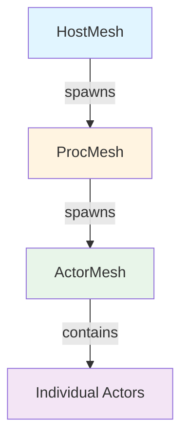
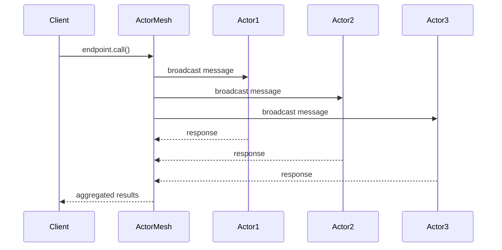
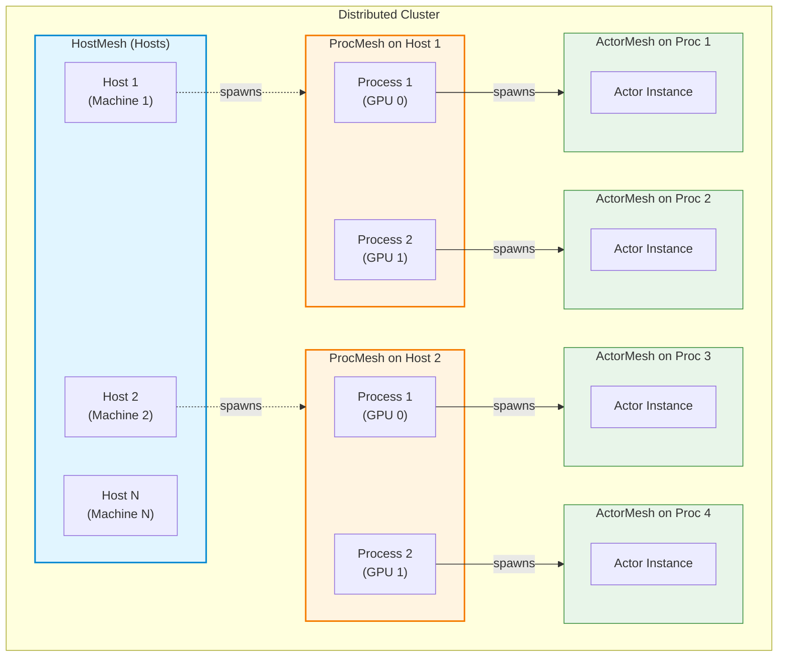
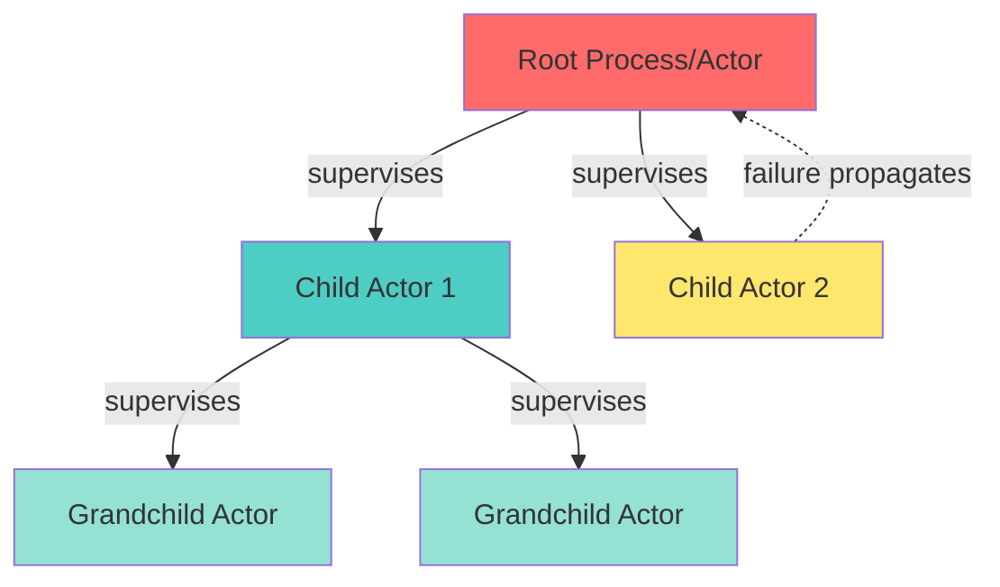
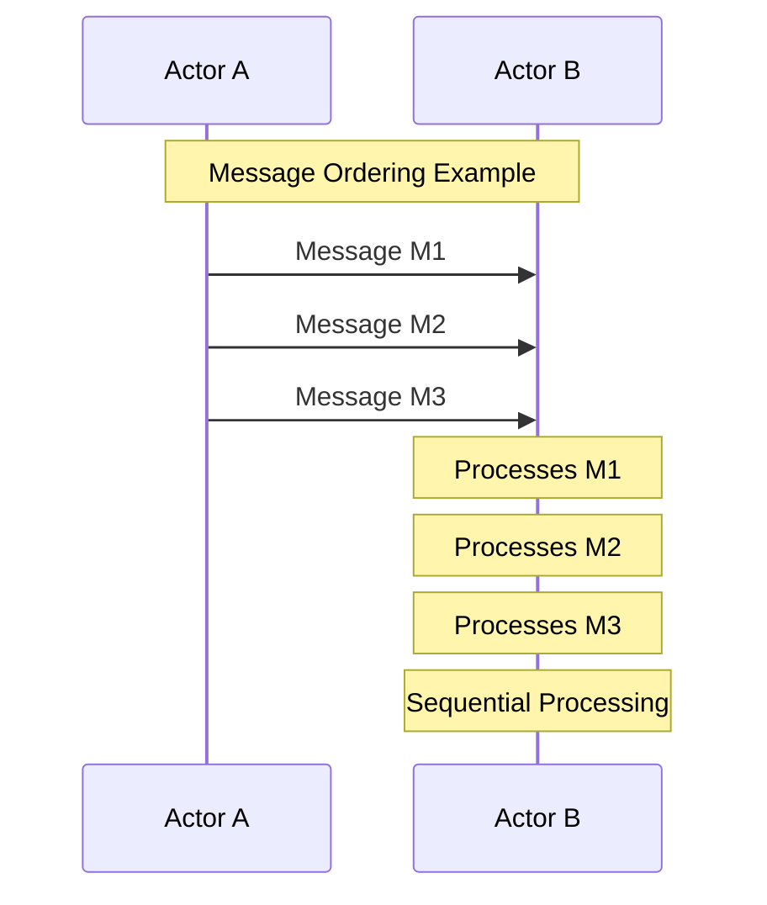
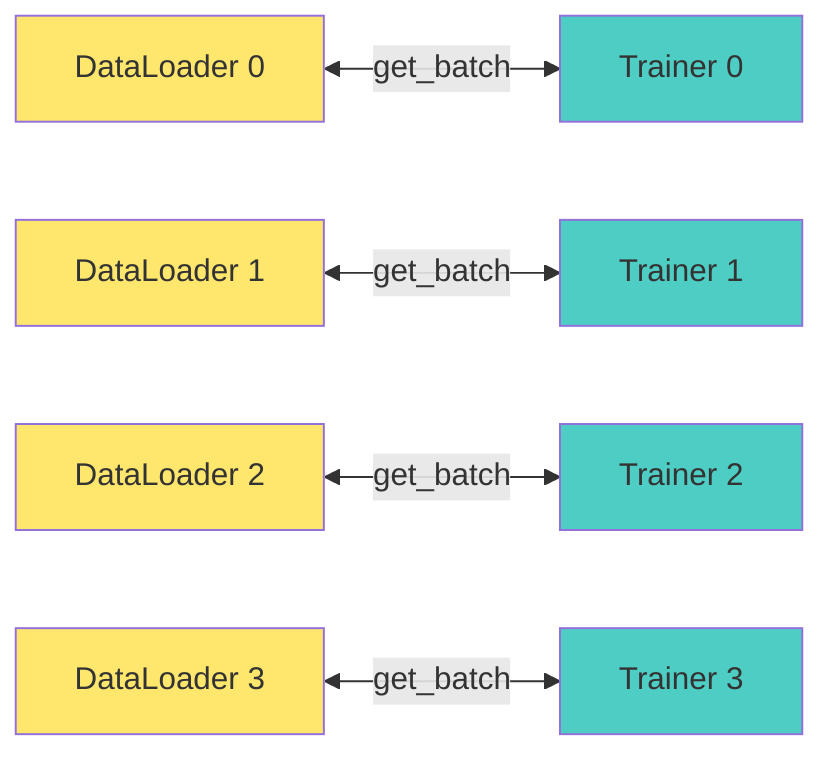

# Monarch: Distributed Programming Framework Overview

## Table of Contents
1. [Introduction](#introduction)
2. [Core Concepts](#core-concepts)
3. [Architecture Overview](#architecture-overview)
4. [Key Components](#key-components)
5. [System Hierarchy](#system-hierarchy)
6. [Detailed Concepts](#detailed-concepts)

---

## Introduction

**Monarch** is a distributed programming framework for PyTorch based on scalable actor messaging. It enables building sophisticated multi-machine training programs with clear semantics for distribution, fault tolerance, and communication patterns.

### Four Major Features

1. **Scalable Messaging**: Using multidimensional meshes of actors with broadcast capabilities
2. **Fault Tolerance**: Through supervision trees and custom supervision handlers
3. **Point-to-Point RDMA**: Low-level memory transfers using libibverbs
4. **Distributed Tensors**: Built-in support for tensors sharded across processes

---

## Core Concepts

### 1. Actor

An **Actor** is an isolated state machine that processes messages asynchronously. Actors are the fundamental unit of computation in Monarch.

**Key Characteristics:**
- Maintains private internal state
- Processes messages sequentially (one at a time)
- Communicates through typed message ports
- Follows strict lifecycle semantics managed by the runtime

**Actor Lifecycle:**
```
Creation → Initialization → Running → Termination
   ↓            ↓             ↓           ↓
 new()      init()      handle messages  cleanup
```

### 2. Mesh

A **Mesh** is a multidimensional container of actors, processes, or hosts. It provides structured organization and enables efficient broadcast communication.

**Mesh Hierarchy:**
```
HostMesh (machines/nodes)
    ↓
ProcMesh (processes)
    ↓
ActorMesh (actors)
```

### 3. Endpoint

An **Endpoint** is a function decorated with `@endpoint` that can be called remotely by other actors. Endpoints define the public API of an actor.

**Messaging Adverbs:**
- `call()`: Broadcast to all actors and collect responses
- `call_one()`: Call a single actor and get response
- `broadcast()`: Send to all actors without waiting for response
- `rref()`: Return distributed tensor reference
- `stream()`: Stream responses as they arrive

### 4. Process (Proc)

A **Process** represents an operating system process that hosts actors. Processes can be distributed across multiple machines.

### 5. Host

A **Host** represents a physical or virtual machine in the cluster. Multiple processes can run on a single host.

---

## Architecture Overview

### System Hierarchy



### Communication Flow



---

## Key Components

### 1. HostMesh

**Purpose:** Represents a collection of compute hosts (machines/nodes) that can spawn processes and actors.

**Key Methods:**
- `spawn_procs()`: Create processes on hosts

**Example:**
```python
from monarch.actor import hosts_from_config, this_host

# Get mesh from config
hosts = hosts_from_config("MONARCH_HOSTS")

# Or use current host
host = this_host()

# Spawn processes
procs = host.spawn_procs(per_host={"gpus": 8})
```

### 2. ProcMesh

**Purpose:** A distributed mesh of processes for actor computation. Represents a collection of processes that can spawn and manage actors.

**Key Methods:**
- `spawn()`: Create actors in the process mesh
- `activate()`: Activate for distributed tensor operations
- `logging_option()`: Configure distributed logging

**Example:**
```python
# Create process mesh
procs = this_host().spawn_procs(per_host={"gpus": 8})

# Spawn actors
actors = procs.spawn("my_actors", MyActor, init_param=value)

# Use for distributed tensors
with procs.activate():
    t = torch.rand(3, 4)  # Distributed across procs
```

### 3. ActorMesh

**Purpose:** A collection of actor instances organized in a multidimensional mesh structure.

**Key Features:**
- Multidimensional indexing with named dimensions
- Slicing operations to select subsets
- Broadcast messaging to all or subset of actors
- Point-to-point actor references

**Example:**
```python
class Trainer(Actor):
    @endpoint
    def train(self, step: int):
        # Training logic
        pass

# Create actor mesh
trainers = procs.spawn("trainers", Trainer)

# Broadcast to all
trainers.train.call(step=0)

# Slice and broadcast to subset
trainers.slice(gpus=slice(0, 4)).train.call(step=1)
```

### 4. Actor

**Purpose:** The fundamental computational unit with private state and message handling.

**Essential Components:**
- `__init__()`: Constructor for actor state
- `@endpoint` decorated methods: Public API
- Message handlers: Process incoming messages

**Example:**
```python
from monarch.actor import Actor, endpoint, context

class Counter(Actor):
    def __init__(self, initial: int):
        self.value = initial

    @endpoint
    def increment(self) -> None:
        self.value += 1

    @endpoint
    def get_value(self) -> int:
        return self.value

# Spawn and use
counter = this_proc().spawn("counter", Counter, initial=0)
counter.increment.call_one()
result = counter.get_value.call_one().get()
```

### 5. Future

**Purpose:** Represents an asynchronous result that may not be available yet.

**Key Methods:**
- `get()`: Block until result is available and return it
- `await`: Use in async context to await result

**Example:**
```python
future = actor.compute.call_one()
result = future.get()  # Blocks until ready

# Or in async context
result = await actor.compute.call_one()
```

### 6. Context

**Purpose:** Provides runtime information about the current execution context.

**Available Information:**
- `actor_instance`: Current actor's instance information
- `message_rank`: Position in the mesh for current message
- `proc`: Current process reference

**Example:**
```python
from monarch.actor import context

class ContextAwareActor(Actor):
    @endpoint
    def get_info(self):
        ctx = context()
        rank = ctx.message_rank
        actor_inst = ctx.actor_instance
        return f"Rank: {rank}, Actor: {actor_inst.rank}"
```

---

## System Hierarchy

### Complete Hierarchy Diagram



---

## Detailed Concepts

### Supervision Tree

Monarch implements a supervision tree similar to Erlang's OTP. Each process and actor has a parent responsible for its health.

**Supervision Hierarchy:**



**Key Behavior:**
- Failures propagate up the tree
- Default: unhandled errors terminate parent
- Custom: implement `__supervise__` method for fine-grained recovery

**Example:**
```python
class SupervisorActor(Actor):
    def __supervise__(self, event):
        print(f"Supervision event: {event}")
        # Custom recovery logic
        # Return True to handle, False to propagate
        return True
```

### Message Ordering Guarantees

Monarch provides strong ordering guarantees for message delivery:

1. **FIFO Ordering**: Messages from actor A to actor B are delivered in send order
2. **Sequential Processing**: Each actor processes messages one at a time
3. **Concurrent Actors**: Different actors in same process handle messages concurrently



### RDMA Support

Monarch provides first-class RDMA (Remote Direct Memory Access) support for efficient data transfers.

**Key Concepts:**
- **RDMABuffer**: Lightweight reference to memory region
- **One-sided transfers**: Read/write without remote CPU involvement
- **Separation of concerns**: Control plane (messages) vs. Data plane (RDMA)

**Example:**
```python
from monarch.rdma import RDMABuffer
import torch

class ParameterServer(Actor):
    def __init__(self):
        self.weights = torch.rand(1000, 1000)
        # Create RDMA buffer (no copy)
        self.buffer = RDMABuffer(self.weights.view(torch.uint8).flatten())

    @endpoint
    def get_weights(self) -> RDMABuffer:
        return self.buffer  # Lightweight reference

class Worker(Actor):
    def __init__(self):
        self.local_weights = torch.zeros(1000, 1000)

    @endpoint
    def sync_weights(self, server: ParameterServer):
        # Get reference (small message)
        ref = server.get_weights.call_one().get()

        # Transfer data (RDMA)
        ref.read_into(self.local_weights.view(torch.uint8).flatten()).get()
```

### Distributed Tensors

Monarch's tensor engine provides distributed PyTorch tensors sharded across process meshes.

**Key Features:**
- Automatic sharding across processes
- Transparent computation with distributed tensors
- Integration with actor endpoints via `rref()` adverb

**Example:**
```python
# Activate process mesh for distributed tensors
with procs.activate():
    t = torch.rand(3, 4)  # Distributed tensor
    result = t @ t.T      # Distributed computation

# Fetch specific shard
from monarch import fetch_shard
shard = fetch_shard(t, hosts=0, gpus=0).get()

# Actor returning distributed tensor
class LinearActor(Actor):
    def __init__(self):
        self.w = torch.rand(3, 3)

    @endpoint(propagate=lambda x: x)
    def forward(self, input):
        return input @ self.w

linear = procs.spawn("linear", LinearActor)
output = torch.relu(linear.forward.rref(t))  # Distributed result
```

### Channels and Ports

Low-level messaging primitives for advanced patterns.

**Concepts:**
- **Channel**: Bidirectional communication channel
- **Port**: Sending endpoint
- **PortReceiver**: Receiving endpoint

**Example:**
```python
from monarch.actor import Channel, Port, send

# Create channel
port, receiver = Channel.open()

# Send message
port.send(42)

# Receive message
msg = receiver.recv().get()

# Use with endpoints
@endpoint(explicit_response_port=True)
def process(self, port: Port[int]):
    # Process asynchronously
    # Send response later
    port.send(result)
```

### Mesh Dimensions and Slicing

Meshes support named dimensions for intuitive organization and slicing.

**Common Dimension Names:**
- `hosts`: Index across machines
- `gpus`: Index across GPUs/processes per host
- `workers`: Custom worker dimension
- `replicas`: Replicas of same actor type

**Slicing Operations:**

```python
# Full mesh
trainers = procs.spawn("trainers", Trainer)

# Slice by dimension
first_gpu = trainers.slice(gpus=0)
gpu_range = trainers.slice(gpus=slice(0, 4))
specific_point = trainers.slice(hosts=1, gpus=3)

# Multi-dimensional slice
subset = trainers.slice(hosts=slice(0, 2), gpus=slice(0, 4))
```

**Slicing Diagram:**

```mermaid
graph LR
    subgraph Full Mesh
        subgraph Host 0
            H0G0[GPU 0]
            H0G1[GPU 1]
            H0G2[GPU 2]
            H0G3[GPU 3]
        end

        subgraph Host 1
            H1G0[GPU 0]
            H1G1[GPU 1]
            H1G2[GPU 2]
            H1G3[GPU 3]
        end
    end

    subgraph Slice: hosts=0
        H0G0
        H0G1
        H0G2
        H0G3
    end

    style H0G0 fill:#4ecdc4
    style H0G1 fill:#4ecdc4
    style H0G2 fill:#4ecdc4
    style H0G3 fill:#4ecdc4
```

---

## Common Scenarios

### Scenario 1: Single Host, Multiple Processes

**Use Case:** Local development or single-machine training with multiple GPUs.

```python
from monarch.actor import this_host, Actor, endpoint

class Trainer(Actor):
    @endpoint
    def train(self, batch):
        # Training logic
        pass

# Spawn 8 processes on current host (one per GPU)
procs = this_host().spawn_procs(per_host={"gpus": 8})
trainers = procs.spawn("trainers", Trainer)

# Train on all GPUs
trainers.train.call(batch=data)
```

**Hierarchy:**
```
this_host()
    └── ProcMesh (gpus: 8)
            └── ActorMesh[Trainer] (8 instances)
```

### Scenario 2: Multiple Hosts, Multiple Processes

**Use Case:** Large-scale distributed training across cluster.

```python
from monarch.actor import hosts_from_config

# Get cluster from scheduler
hosts = hosts_from_config("MONARCH_HOSTS")  # e.g., 32 hosts
print(hosts.extent)  # {"hosts": 32}

# Spawn 8 processes per host (one per GPU)
procs = hosts.spawn_procs(per_host={"gpus": 8})
print(procs.extent)  # {"hosts": 32, "gpus": 8}

# Spawn actors
trainers = procs.spawn("trainers", Trainer)

# All 256 trainers (32 * 8) execute in parallel
trainers.train.call(step=0)
```

**Hierarchy:**
```
HostMesh (hosts: 32)
    └── ProcMesh (hosts: 32, gpus: 8)
            └── ActorMesh[Trainer] (256 instances)
```

### Scenario 3: Actor-to-Actor Communication

**Use Case:** Actors need to communicate directly (e.g., DataLoader → Trainer).

```python
class DataLoader(Actor):
    def __init__(self):
        self.data_index = 0

    @endpoint
    def get_batch(self):
        self.data_index += 1
        return f"batch_{self.data_index}"

class Trainer(Actor):
    def __init__(self, dataloader: DataLoader):
        # Get corresponding dataloader for this rank
        rank = context().actor_instance.rank
        self.dataloader = dataloader.slice(**rank)

    @endpoint
    def train_step(self):
        batch = self.dataloader.get_batch.call_one().get()
        # Train with batch
        return f"trained with {batch}"

# Spawn both
dataloaders = procs.spawn("dataloaders", DataLoader)
trainers = procs.spawn("trainers", Trainer, dataloaders)

# Execute training
results = trainers.train_step.call().get()
```

**Communication Pattern:**



### Scenario 4: RDMA-Based Parameter Server

**Use Case:** Centralized parameter storage with RDMA transfers.

```python
from monarch.rdma import RDMABuffer
import torch

class ParameterServer(Actor):
    def __init__(self, model_size):
        self.params = torch.randn(model_size)
        self.param_buffer = RDMABuffer(self.params.view(torch.uint8).flatten())

    @endpoint
    def get_params(self) -> RDMABuffer:
        return self.param_buffer

    @endpoint
    def update_params(self, gradients):
        self.params -= 0.01 * gradients

class Worker(Actor):
    def __init__(self, param_server: ParameterServer):
        self.ps = param_server.slice(gpus=0)  # Single server
        self.local_params = torch.zeros_like(...)

    @endpoint
    def train_and_sync(self):
        # Pull parameters via RDMA
        param_ref = self.ps.get_params.call_one().get()
        param_ref.read_into(self.local_params.view(torch.uint8).flatten()).get()

        # Train locally
        gradients = self.compute_gradients()

        # Push gradients via message
        self.ps.update_params.call_one(gradients)

# 1 parameter server, 8 workers
ps_proc = this_host().spawn_procs(per_host={"gpus": 1})
worker_procs = this_host().spawn_procs(per_host={"gpus": 8})

ps = ps_proc.spawn("ps", ParameterServer, model_size=1000000)
workers = worker_procs.spawn("workers", Worker, ps)

# Training loop
workers.train_and_sync.call()
```

---

## Quick Reference

### Common Imports

```python
from monarch.actor import (
    Actor,              # Base actor class
    endpoint,           # Decorator for remote methods
    context,            # Get execution context
    Future,             # Async result

    # Mesh types
    HostMesh,           # Host mesh
    ProcMesh,           # Process mesh

    # Utilities
    this_host,          # Current host
    this_proc,          # Current process
    hosts_from_config,  # Load host config

    # Messaging
    Channel,            # Create channels
    Port,               # Send port
    PortReceiver,       # Receive port
    send,               # Send to port

    # Info
    current_rank,       # Current rank
    current_size,       # Mesh size
)

from monarch.rdma import RDMABuffer
from monarch import fetch_shard, remote
```

### Essential Patterns

#### 1. Spawn Actors
```python
procs = this_host().spawn_procs(per_host={"gpus": 8})
actors = procs.spawn("name", ActorClass, *args, **kwargs)
```

#### 2. Call Endpoints
```python
# Single actor
result = actor.method.call_one(arg).get()

# All actors
results = actors.method.call(arg).get()

# Fire-and-forget
actors.method.broadcast(arg)
```

#### 3. Slice Mesh
```python
# By index
actor_0 = actors.slice(gpus=0)

# By range
subset = actors.slice(gpus=slice(0, 4))

# By point
specific = actors.slice(hosts=1, gpus=3)
```

#### 4. Access Context
```python
@endpoint
def method(self):
    ctx = context()
    rank = ctx.message_rank
    actor_inst = ctx.actor_instance
```

#### 5. Distributed Tensors
```python
with procs.activate():
    t = torch.rand(3, 4)
    result = t @ t.T
```

#### 6. RDMA Transfer
```python
buffer = RDMABuffer(tensor.view(torch.uint8).flatten())
# ... send buffer reference ...
buffer_ref.read_into(local_tensor.view(torch.uint8).flatten()).get()
```

---

## Summary

Monarch provides a powerful actor-based framework for distributed PyTorch applications with:

1. **Clear Hierarchy**: Hosts → Processes → Actors
2. **Flexible Messaging**: Broadcast, point-to-point, streaming
3. **Mesh Organization**: Multidimensional, named dimensions, slicing
4. **Fault Tolerance**: Supervision trees, custom handlers
5. **High Performance**: RDMA support, distributed tensors
6. **Type Safety**: Typed endpoints, IDE autocomplete

The framework enables building scalable, fault-tolerant distributed training systems with intuitive APIs and strong guarantees.

---

## Next Steps

For detailed information, see:
- [Actor Concepts](./ACTORS.md) - Deep dive into actors
- [Mesh Concepts](./MESHES.md) - Comprehensive mesh documentation
- [Examples](../examples/) - Code examples
- [API Reference](./api/) - Complete API documentation
